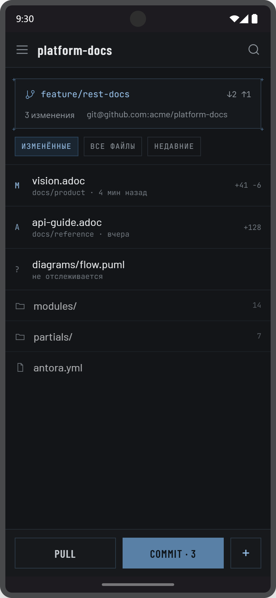
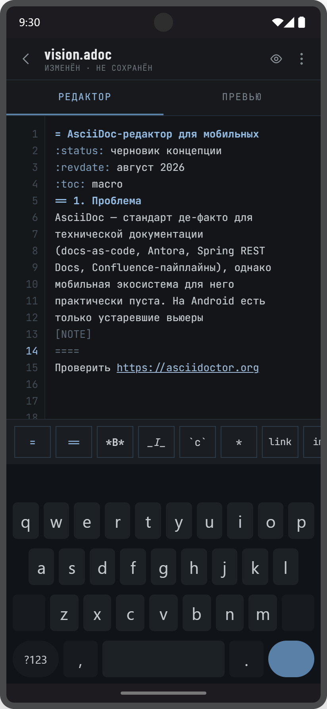
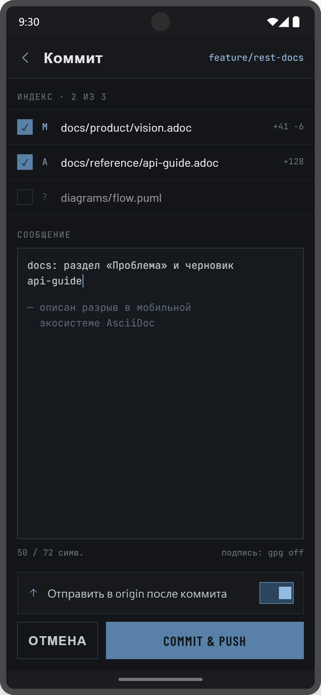
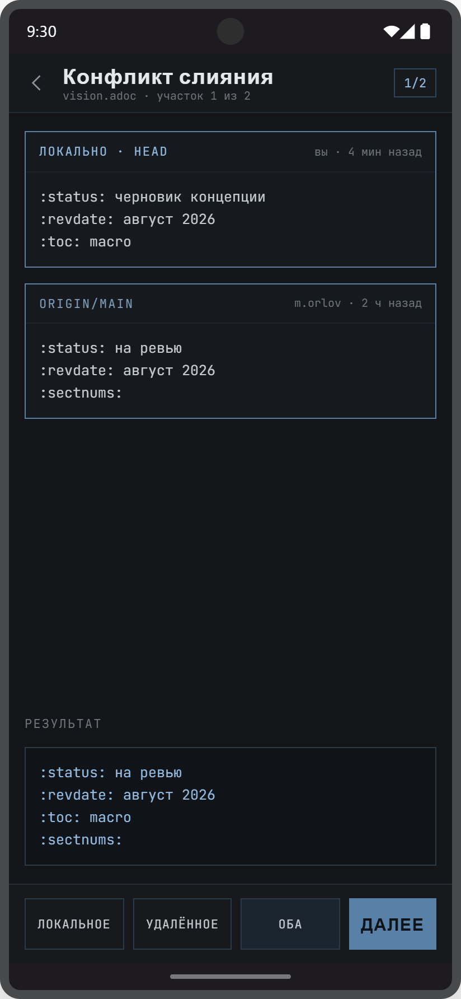
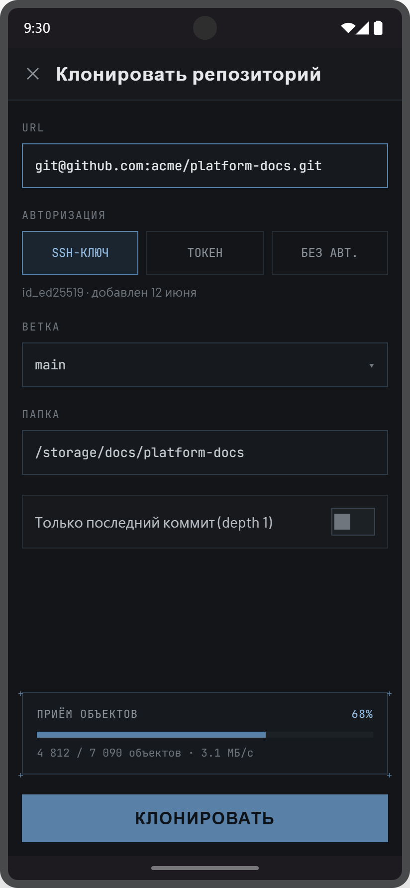
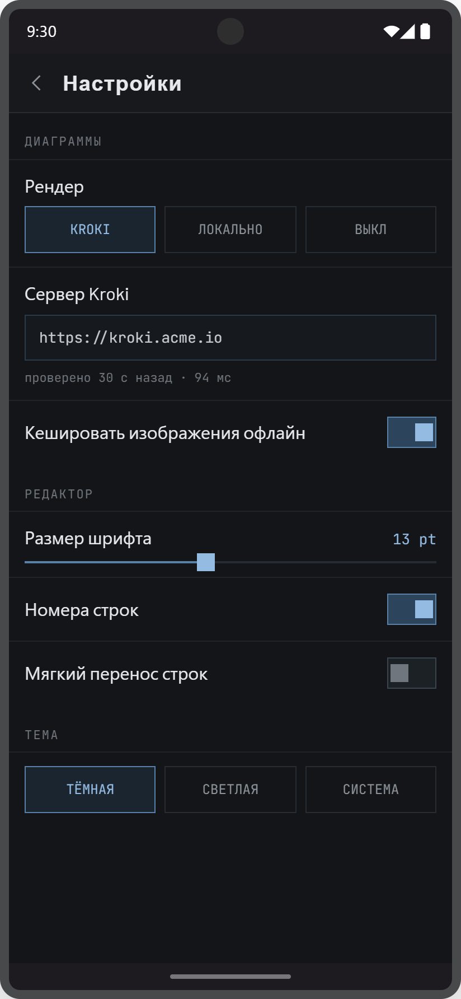
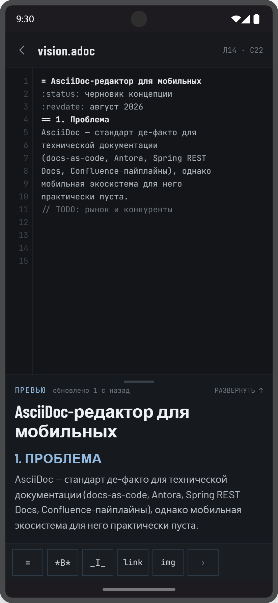
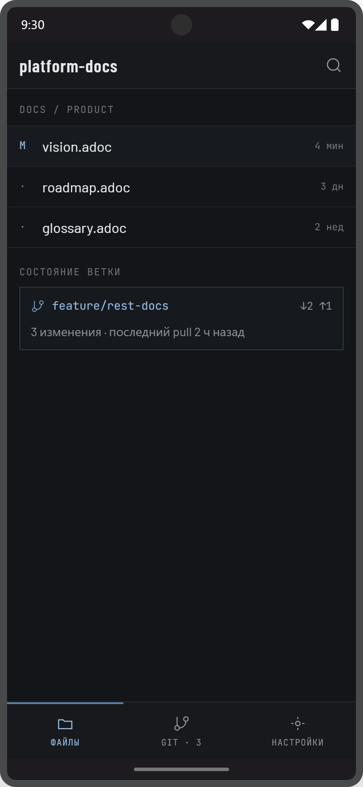

= AsciiDoc-редактор — описание дизайна
:toc: macro
:toc-title: Содержание
:sectnums:
:sectanchors:
:sectnumlevels: 2
:imagesdir: .
:status: черновик
:revdate: 2026-08-16
:icons: font

[.lead]
Визуальный язык, токены, компоненты и экраны мобильного приложения.
Документ описывает, *как выглядит* продукт из xref:../asciidoc-editor-vision.adoc[видения]; поведение экранов задано в xref:../user-stories.adoc[пользовательских историях].

toc::[]

== Источники

Дизайн пришёл handoff-бандлом из Claude Design и лежит рядом с этим документом:

[cols="2,3", options="header"]
|===
| Путь | Что это

| `project/AsciiDoc Mobile.dc.html`
| Первичный макет: все экраны обоих потоков, включая интерактивные состояния. Источник истины по размерам и цветам.

| `project/android-frame.jsx`
| Рамка устройства и экранная клавиатура прототипа. Оформление стенда, не часть продукта.

| `project/support.js`
| Рантайм прототипа (`x-import`, `sc-if`, `{{ }}`). Служебный код макета — не переносится в приложение.

| `project/_ds/industry-.../styles.css`
| Токены дизайн-системы «Industry» в *светлой* редакции. Приложение использует тёмную; общее — акцент и его ramp.

| `AsciiDoc Mobile-selection*.png`
| Снимки экранов, на которые ссылается этот документ.

| `README.md`
| Файл из бандла-источника. Оставлен в исходном виде как ввозной артефакт — см. xref:../documentation-rules.adoc[правила].
|===

[IMPORTANT]
====
Макет — прототип на HTML/CSS, а не эталон реализации.
Переносится визуальный результат (размеры, цвета, ритм), а не внутреннее устройство прототипа.
====

== Визуальный язык

Оформление — технический чертёж: тёмный ground, стальной акцент, тонкие линии, ничего лишнего.

Прямые углы::
Скруглений нет нигде: ни у кнопок, ни у полей, ни у карточек. В Compose это значит `RectangleShape` по умолчанию, а не подгонка радиусов по месту.

Линия вместо заливки::
Контейнеры — рамка в 1 px на слегка приподнятом фоне. Единственный сплошной объект в интерфейсе — первичная кнопка, залитая акцентом.

Регистрационные метки::
Ключевые блоки (карточка ветки, блок прогресса клонирования, плейсхолдер диаграммы) несут четыре знака `+` по углам, вынесенных за рамку на 5–6 px. Это метка «чертёжного» объекта; на обычных строках списка её нет.

Моноширинный шрифт как носитель смысла::
Всё машинное — пути, ветки, хеши, статусы, счётчики диффа, служебные метки разделов — набрано JetBrains Mono. Человеческий текст — Barlow. По шрифту видно, что пришло из Git, а что написал человек.

Плотность выше типовой мобильной::
Строки списка 13 px по вертикали, служебные подписи 10–11 px. Интерфейс рассчитан на инженера, который смотрит на плотный текст, а не на витрину.

== Токены

=== Палитра (тёмная тема)

Ровно один акцент — стальной `#5980a6` и его ramp. Декоративных цветов нет: статусы и состояния различаются шагом того же ramp, а не новым оттенком.

[cols="2,1,3", options="header"]
|===
| Роль | Значение | Где

| Фон экрана
| `#131518`
| Основной ground всех экранов

| Панели (app bar, вкладки, нижняя панель)
| `#17191c`
| Верхняя и нижняя хром-панели

| Приподнятая поверхность
| `#16191d`
| Поля ввода, карточки, блоки кода

| Утопленная поверхность
| `#101317`
| Блок «Результат» на экране конфликта

| Фон панели вставки
| `#1a1d21`
| Тулбар над клавиатурой

| Граница панелей
| `#262c33`
| Разделители хром-панелей, неактивные сегменты

| Граница объекта
| `#2c3a47`
| Рамки карточек, полей, вторичных кнопок

| Разделитель списка
| `#1f242a`
| Строки файлов, строки настроек

| Акцент
| `#5980a6`
| Заливка первичной кнопки, метки `+`, прогресс, активная граница

| Акцент — наведение
| `#749dc4`
| Hover первичной кнопки, иконки в чертёжных блоках

| Акцент — активный текст
| `#94bce3`
| Активная вкладка, имя ветки, ссылки, выделенный номер строки

| Акцент — вторичный текст
| `#7e9cb8`
| Атрибуты документа в подсветке, статус `A`

| Акцент — фон выбора
| `#1a2530`
| Выбранный сегмент, выбранный вариант конфликта

| Акцент — трек переключателя
| `#2c455d`
| Включённый toggle, рамка чипа

| Текст на акценте
| `#0d1318`
| Подпись первичной кнопки, галочка чекбокса

| Текст основной
| `#e6e8ea`
| Заголовки, имена файлов

| Текст вторичный
| `#c6cbd0`
| Код в редакторе, подписи вторичных кнопок

| Текст абзаца в превью
| `#b9bfc5`
| Тело admonition, абзацы панели превью

| Текст приглушённый
| `#8b9299`
| Иконки хром-панели, вспомогательные подписи

| Текст служебный
| `#6f767d`
| Метки разделов, время, счётчики диффа

| Комментарий
| `#5d6a75`
| Комментарии и разделители блоков в подсветке

| Номера строк
| `#414a53`
| Колонка номеров (в варианте 1b — `#3a434b`)
|===

Светлая тема в макетах не проработана: в настройках переключатель есть, значения не заданы.
Пока светлая тема не описана, реализовывать её нельзя «по интуиции» — палитра выводится отдельно и вносится в этот раздел.

=== Семантические цвета

Диагностика документа (xref:../user-stories.adoc#US-E2-05[US-E2-05]) требует цвета вне стального акцента — единственное осознанное исключение из правила «декоративного цвета не добавляем».
Обоснование: уровень проблемы — это смысл, а не украшение, и оттенком акцента он не передаётся.

Значения в макетах не заданы и выдумывать их нельзя.
Способ вывода задан дизайн-системой: рампы построены в OKLCH по общей шкале светлоты, поэтому `error` и `warning` берутся тем же шагом шкалы, что `accent-500`, — тогда они не выпадают по визуальному весу из чертёжного языка.

[cols="1,3", options="header"]
|===
| Роль | Где

| `error`
| Метка уровня `ERROR` в колонке номеров, подчёркивание фрагмента, счётчик в строке проблем

| `warning`
| То же для уровня `WARN`
|===

Правила применения:

* Цветом помечается только уровень проблемы. Статусы Git, выбор и активность по-прежнему выражаются акцентом.
* Цвет не единственный носитель: у метки в колонке есть ещё и знак, иначе диагностика пропадает для дальтоника и на плохом экране.
* Волнистое подчёркивание не используется — `TextDecoration` в Compose умеет только сплошное, а отрисовка волны поверх текста ломает самую хрупкую часть раскладки.

Строка проблем стоит между текстом и панелью вставки, набирается моноширинным шрифтом 11 px прописными и при нулевом числе проблем не занимает высоту.

=== Типографика

[cols="1,2,2", options="header"]
|===
| Гарнитура | Где | Начертания и метрики

| Barlow Condensed
| Заголовки экранов, подписи кнопок, заголовки в превью
| 600; заголовок экрана 19–20 px / `letter-spacing .04em`; кнопка 15–17 px / `.06em`, прописные; заголовок документа в превью 26–30 px

| Barlow
| Человеческий текст: имена файлов, названия настроек, абзацы превью
| 400/500; список 15–16 px; абзац 15–16 px / `line-height 1.5–1.55`

| JetBrains Mono
| Код, пути, ветки, счётчики, служебные метки
| 400/500/700; код редактора 13 px / 21 px (вариант 1b — 12 px / 19 px); метка раздела 10–11 px / `letter-spacing .1em`, прописные
|===

Служебная метка раздела (`ИНДЕКС · 2 ИЗ 3`, `СООБЩЕНИЕ`, `ДИАГРАММЫ`) — это моноширинный шрифт 11 px с широким трекингом, а не уменьшенный заголовок.

=== Метрики

[cols="3,1", options="header"]
|===
| Элемент | Размер

| Экран устройства в макете
| 412 × 892

| Горизонтальные поля экрана
| 14

| App bar
| 52

| Полоса вкладок «Редактор/Превью»
| 44

| Нижняя навигация (вариант 1b)
| 62

| Первичная кнопка
| 46–48

| Кнопка панели вставки
| 44 × 38

| Строка списка файлов
| 13 по вертикали + содержимое

| Колонка номеров строк
| 40 (в варианте 1b — 34)

| Переключатель (toggle)
| 38 × 22, бегунок 16 × 16

| Вынос меток `+` за рамку
| 5–6
|===

== Компоненты

Первичная кнопка::
Заливка `#5980a6`, текст `#0d1318`, Barlow Condensed прописными. Единственный сплошной объект на экране; на экране не больше одной.

Вторичная кнопка::
Прозрачный фон, рамка `#2c3a47`, текст `#c6cbd0`. Наведение — фон `#1c242c`.

Сегментированный переключатель::
Равные ячейки высотой 40–42, моноширинная подпись прописными. Выбранный сегмент: рамка `#5980a6`, фон `#1a2530`, текст `#94bce3`. Применяется для выбора авторизации, режима диаграмм и темы.

Чип-фильтр::
Тот же принцип в компактной форме — фильтры `ИЗМЕНЁННЫЕ` / `ВСЕ ФАЙЛЫ` / `НЕДАВНИЕ` над списком файлов.

Поле ввода::
Фон `#16191d`, рамка `#2c3a47`, содержимое моноширинным шрифтом. В фокусе рамка становится акцентной (`#5980a6`). Над полем — служебная метка, под полем — при необходимости строка статуса.

Переключатель (toggle)::
Прямоугольный: трек 38 × 22, бегунок 16 × 16 без скруглений. Включён — трек `#2c455d`, рамка `#5980a6`, бегунок `#94bce3`; выключен — трек `#1c2126`, рамка `#3a444e`, бегунок `#6f767d`.

Чекбокс::
Квадрат 18 × 18. Отмечен — заливка акцентом с галочкой цветом `#0d1318`; снят — только рамка `#3a444e`.

Строка файла::
Колонка статуса Git фиксированной ширины (`M`, `A`, `?`, иконка папки), имя файла шрифтом Barlow, под ним путь и время моноширинным, справа счётчик диффа. Папки и неизменённые файлы приглушены до 72 % непрозрачности.

Слайдер::
Трек 2 px, заполнение акцентом, бегунок — квадрат 16 × 16 цвета `#94bce3`. Текущее значение вынесено вправо от названия настройки.

Индикатор прогресса::
Полоса 6 px без скруглений в чертёжном блоке с метками `+`; над ней — подпись и процент, под ней — числа и скорость.

Чертёжный блок::
Контейнер с рамкой `#2c3a47` и четырьмя `+` по углам. Носители: карточка состояния ветки, блок прогресса клонирования, плейсхолдер диаграммы в превью.

== Экраны: основной поток

Семь состояний в шести экранах, тёмная тема, Android.

=== 01 · Репозиторий

Точка входа при работе с Git-репозиторием.
Сверху — карточка ветки (чертёжный блок): имя ветки, счётчики `↓2 ↑1`, число изменений и адрес remote.
Ниже — фильтры и список файлов со статусами.
Внизу закреплена панель действий: вторичная `PULL`, первичная `COMMIT · 3` со счётчиком изменений и квадратная кнопка `+`.

Истории: xref:../user-stories.adoc#US-E1-04[US-E1-04], xref:../user-stories.adoc#US-E5-02[US-E5-02], xref:../user-stories.adoc#US-E5-03[US-E5-03].

=== 02 · Редактор

App bar показывает имя файла и состояние документа (`ИЗМЕНЁН · НЕ СОХРАНЁН`) моноширинной меткой, справа — переключатель превью и меню.
Ниже — вкладки `РЕДАКТОР` / `ПРЕВЬЮ`; активная помечена акцентной линией снизу.

Полотно редактора: колонка номеров на утопленном фоне `#15181b` с правой границей, номер текущей строки — акцентом.
Подсветка в макете: заголовки `#94bce3` полужирным, атрибуты `#7e9cb8`, разделители блоков и `[NOTE]` — `#5d6a75`, ссылки — подчёркнутые `#9ebbd8`, каретка — акцентный блок.

Между текстом и клавиатурой — горизонтально прокручиваемая панель вставки; последняя кнопка `›` раскрывает остальные конструкции.

Истории: xref:../user-stories.adoc#US-E2-01[US-E2-01], xref:../user-stories.adoc#US-E2-02[US-E2-02], xref:../user-stories.adoc#US-E4-01[US-E4-01].

=== 02a · Превью

Второе состояние того же экрана (в макете — вкладка `ПРЕВЬЮ`, отдельного снимка нет; см. `project/AsciiDoc Mobile.dc.html`).

Заголовок документа набран Barlow Condensed 30 px, под ним — атрибуты документа моноширинной строкой прописными, дальше — горизонтальная линия и текст.
Admonition — рамка `#2c3a47` на фоне `#16191d` с моноширинным ярлыком `NOTE` акцентом.
Диаграмма, пока не пришла с Kroki, показана чертёжным блоком в клетку с подписью `KROKI · PLANTUML · СБОРКА…`; под ним — подпись рисунка.

Истории: xref:../user-stories.adoc#US-E3-01[US-E3-01], xref:../user-stories.adoc#US-E3-02[US-E3-02], xref:../user-stories.adoc#US-E6-01[US-E6-01].

=== 03 · Commit / Push

Индекс с чекбоксами, метками статуса и счётчиками диффа; неотслеживаемый файл по умолчанию снят и приглушён.
Поле сообщения занимает свободную высоту, черновик описания идёт приглушённым цветом.
Под полем — счётчик символов и состояние подписи.
Внизу — переключатель «Отправить в origin после коммита» и пара кнопок `ОТМЕНА` / `COMMIT & PUSH`.

История: xref:../user-stories.adoc#US-E5-04[US-E5-04].

=== 04 · Конфликт слияния

Две версии участка — `ЛОКАЛЬНО · HEAD` и `ORIGIN/MAIN` — с автором и временем в шапке каждой.
Выбранная сторона получает акцентную рамку, невыбранная — обычную `#262c33`.
Внизу блок `РЕЗУЛЬТАТ` показывает, что получится, и пересобирается сразу при выборе.
Панель действий: `ЛОКАЛЬНОЕ` / `УДАЛЁННОЕ` / `ОБА` (выбранный — фон `#1a2530`) и первичная `ДАЛЕЕ`.
В app bar — счётчик участков `1/2`.

История: xref:../user-stories.adoc#US-E5-05[US-E5-05].

=== 05 · Клонирование

Форма из четырёх блоков: URL (в фокусе — акцентная рамка), способ авторизации сегментированным переключателем с подписью выбранного ключа, ветка (выпадающий список), целевая папка.
Ниже — опция `depth 1`.
Прогресс приёма объектов прижат к низу отдельным чертёжным блоком и появляется только во время операции.
Первичная кнопка `КЛОНИРОВАТЬ` — во всю ширину.

История: xref:../user-stories.adoc#US-E5-01[US-E5-01].

=== 06 · Настройки

Три группы, разделённые моноширинными метками: `ДИАГРАММЫ`, `РЕДАКТОР`, `ТЕМА`.
В первой — режим рендера (`KROKI` / `ЛОКАЛЬНО` / `ВЫКЛ`), адрес сервера с результатом проверки (`проверено 30 с назад · 94 мс`) и офлайн-кэш.
Во второй — размер шрифта слайдером, номера строк, мягкий перенос.
В третьей — выбор темы.

Истории: xref:../user-stories.adoc#US-E2-04[US-E2-04], xref:../user-stories.adoc#US-E6-01[US-E6-01], xref:../user-stories.adoc#US-E6-02[US-E6-02], xref:../user-stories.adoc#US-E8-01[US-E8-01].

== Экраны: вариант 1b

Альтернативная раскладка того же продукта: превью не вкладкой, а вытягиваемой панелью; подсветка — только по структуре; навигация — нижняя.
Вариант не отменяет основной поток, а предлагает другой компромисс по плотности (12 pt / 19 px против 13 pt / 21 px).

=== 1b · Редактор с панелью превью

Вкладок нет: превью занимает нижнюю треть, тянется вверх за ручку, в шапке — свежесть рендера и подсказка `РАЗВЕРНУТЬ ↑`.
В app bar вместо статуса файла — позиция каретки `Л14 · С22`.
Подсветка монохромная: заголовки выделены только весом и цветом `#e6e8ea`, акцент оставлен служебным элементам.
Панель вставки сокращена до шести кнопок.

Истории: xref:../user-stories.adoc#US-E3-03[US-E3-03], xref:../user-stories.adoc#US-E2-03[US-E2-03].

=== 1b · Файлы с нижней навигацией

Файлы сгруппированы по каталогу (`DOCS / PRODUCT`), состояние ветки вынесено отдельным блоком ниже списка.
Внизу — три раздела: `ФАЙЛЫ`, `GIT · 3` со счётчиком изменений, `НАСТРОЙКИ`; активный помечен акцентной линией сверху.

=== Выбор сделан: реализуется 1a

[IMPORTANT]
====
Раскладка зафиксирована 2026-08-17: реализуется *вариант 1a* — превью вкладкой, цветная подсветка по типам конструкций, экран репозитория как корень навигации.
Обоснование и отвергнутые альтернативы — в xref:../adr/adr-003-layout-1a.adoc[ADR-003].

Экраны варианта 1b ниже сохранены как свидетельство проработки, а не как задание на реализацию.
Отдельные его идеи — позиция каретки в заголовке, группировка файлов по каталогу, свёрнутый тулбар на узких экранах — не выброшены и перечислены в ADR.
====

== Состояния и взаимодействие

Наведение и нажатие::
Берутся шагом акцентного ramp: первичная кнопка `#5980a6` → `#749dc4`, вторичная — фон `#1c242c`. Браузерные и системные дефолты не используются.

Фокус клавиатуры::
Обводка 2 px акцентом с отступом 2 px. Для полей ввода фокус выражается акцентной рамкой самого поля.

Выбор::
Выбранное состояние всегда двойное — рамка `#5980a6` плюс фон `#1a2530`. Только цветом текста выбор не показывается.

Недоступность::
Прозрачность 45 %; для второстепенных строк списка (папки, неизменённые файлы) — 60–72 %.

Выделение текста::
Акцентная подложка (`#5980a6` под кареткой в редакторе).

Прогресс::
Всегда с числами: процент, абсолютные значения, скорость. Голая полоса без цифр в этом языке не используется.

== Как это ложится на Compose Multiplatform

Дизайн не типовой Material, поэтому тема задаётся явно:

* Формы — `RectangleShape` для всех компонентов; скругления не «занулять по месту», а выключить в теме.
* Три семейства шрифтов подключаются как ресурсы `commonMain` и раздаются через собственную типографику: `heading` (Barlow Condensed), `body` (Barlow), `mono` (JetBrains Mono).
* Палитра выносится отдельным набором токенов — ролями из раздела «Токены», а не цветами Material (`primary`/`surface` не покрывают роли «граница объекта», «утопленная поверхность», «служебный текст»).
* Метки `+` — не картинка, а декоратор контейнера: общий модификатор/обёртка, которая рисует четыре знака с выносом за границу.
* Панель вставки живёт над IME и обязана учитывать `WindowInsets.ime`: между текстом и клавиатурой не должно оставаться разрыва, каретка не должна уходить под панель.
* Превью — платформенный WebView; его фон задаётся в CSS темы превью, иначе в тёмной теме мелькает белый лист.

== Открытые вопросы

* Светлая тема: значений в макетах нет (см. «Палитра»).
* Семантические цвета `error`/`warning`: способ вывода задан, конкретные значения не утверждены (см. «Семантические цвета»).
* Строка проблем и метки диагностики в колонке номеров в макетах не нарисованы — есть только описание.
* Планшетная раскладка side-by-side из видения в макетах не нарисована.
* Экран истории изменений файла (xref:../user-stories.adoc#US-E5-06[US-E5-06]) не спроектирован.
* Состояния пустоты и ошибок (пустой репозиторий, нет сети при pull, отказ авторизации) в макетах отсутствуют.

== Связанные документы

* xref:../asciidoc-editor-vision.adoc[Продуктовое видение]
* xref:../user-stories.adoc[Пользовательские истории]
* xref:../documentation-rules.adoc[Правила ведения документации]
